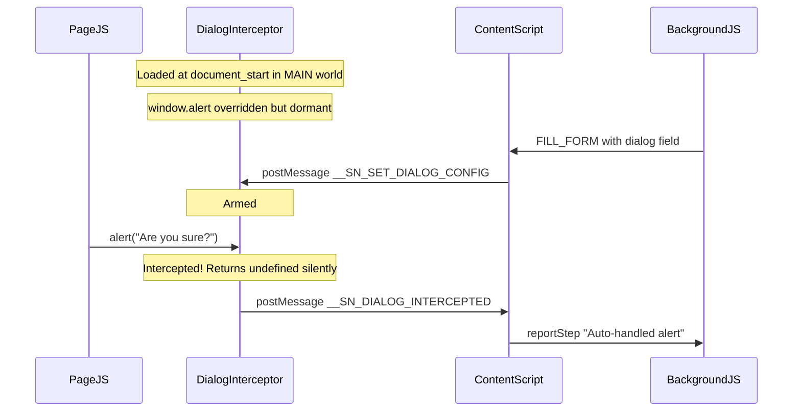

# Dialog Interception Plan

## Why previous attempts failed

The root cause was **timing**: the interceptor was injected via `chrome.scripting.executeScript` at runtime (when user clicked Run), which happens AFTER the page JS has loaded. If the page or ServiceNow caches a reference to the original `window.alert` before our script runs, or CSP blocks dynamic script injection, the override never takes effect.

The `chrome.debugger` approach requires the user to accept a debugging banner and had reliability issues with event delivery to the service worker.

## The approach that will always work

Register `dialog-interceptor.js` as a **manifest content script** with `"world": "MAIN"` and `"run_at": "document_start"`. This runs in the page's own JS context BEFORE any page JavaScript, guaranteeing our `window.alert` override is in place before any code can call or cache a reference to the original.

The interceptor is **dormant by default** (passes through to real `alert`). Only when the content script arms it via `window.postMessage` does it start intercepting.




## Current state of each file

- **[dialog-interceptor.js](servicenow-group-join-extension/src/dialog-interceptor.js)** -- File exists with overrides for alert/confirm/prompt and the postMessage config listener. Needs simplification to alert-only. NOT registered in manifest.
- **[manifest.json](servicenow-group-join-extension/manifest.json)** -- Missing `content_scripts` entry entirely. No `debugger` permission (good).
- **[content-script.js](servicenow-group-join-extension/src/content-script.js)** -- Dialog field handler was removed entirely. The field loop goes: expand (line 66) -> button (line 114) -> input fields. Dialog handler must be re-added between expand and button.
- **[options.js](servicenow-group-join-extension/src/options.js)** -- "dialog" removed from fieldType dropdown (line 456-461). Also missing from: badge map (line 426-432), type class map (line 421), `renderPayloadForm` action row check (line 337), `readPayloadFromForm` skip list (line 397).
- **[options.css](servicenow-group-join-extension/src/options.css)** -- No dialog-specific styles. Needs badge/border styles.
- **[sidepanel.js](servicenow-group-join-extension/src/sidepanel.js)** -- Already includes "dialog" in `ACTION_TYPES` array (line 274). No changes needed.
- **[popup.js](servicenow-group-join-extension/src/popup.js)** -- Already includes "dialog" in `ACTION_TYPES` array. No changes needed.
- **[background.js](servicenow-group-join-extension/src/background.js)** -- Clean, no dialog logic. No changes needed.

## Scope: Alert only (first pass)

Only implement alert handling. No confirm/prompt. This keeps the implementation small and verifiable.

## Changes required

### 1. manifest.json -- Register the interceptor

Add after the `"action"` block (before `"side_panel"`):

```json
"content_scripts": [
  {
    "matches": ["<all_urls>"],
    "js": ["src/dialog-interceptor.js"],
    "run_at": "document_start",
    "world": "MAIN"
  }
]
```

### 2. dialog-interceptor.js -- Rewrite for alert only

Replace entire file. Keep it minimal:

- Guard against double-install (`__snDialogInterceptorInstalled`)
- Listen for `__SN_SET_DIALOG_CONFIG` and `__SN_CLEAR_DIALOG_CONFIG` via `window.addEventListener("message")`
- Store original `window.alert`, override with: if config is set, log + post `__SN_DIALOG_INTERCEPTED` + return; else call original
- Remove confirm/prompt overrides entirely for now

### 3. content-script.js -- Add dialog handler in field loop

Insert a new block at line 113 (between the expand `continue` and the button handler):

```javascript
if (cfg.fieldType === "dialog") {
  reportStep(`[${i+1}/${fieldConfigs.length}] Arming alert interceptor...`, "step");
  window.postMessage({ type: "__SN_SET_DIALOG_CONFIG", dialogAction: "ok" }, "*");
  // Wait for interception or timeout
  await new Promise((resolve) => {
    let done = false;
    const timer = setTimeout(() => { if (!done) { done = true; resolve(); } }, 500);
    const handler = (e) => {
      if (e.data?.type === "__SN_DIALOG_INTERCEPTED") {
        window.removeEventListener("message", handler);
        clearTimeout(timer);
        if (!done) { done = true; reportStep(`  Alert auto-dismissed: "${e.data.message}"`, "step"); resolve(); }
      }
    };
    window.addEventListener("message", handler);
  });
  continue;
}
```

### 4. options.js -- Add dialog to the UI in 5 spots

- **fieldType dropdown** (line ~461): Add `<option value="dialog">Dialog (alert)</option>` after expand
- **Type class map** (line ~421): Add `dialog: "field-item-dialog"`
- **Badge map** (line ~426): Add `dialog: '<span class="field-type-badge badge-dialog">Action: Dialog</span>'`
- **renderPayloadForm** (line ~337): Add `const isDialog = cfg.fieldType === "dialog"` and include it in the action-row check: `if (isButton || isExpand || isDialog)`
- **readPayloadFromForm** (line ~397): Add `"dialog"` to the skip list: `if (cfg.fieldType === "button" || cfg.fieldType === "expand" || cfg.fieldType === "dialog") return;`
- **Visibility**: Hide labelMatch, ajaxWait, dropdownRetries, buttonWait for dialog (same as button)

### 5. options.css -- Add dialog styles

Add badge and border accent styles for dialog type (orange theme to distinguish from button yellow and expand purple):

- `.badge-dialog` -- orange background/text
- `.field-item-dialog` -- orange left border accent
- `.payload-action-dialog` -- orange accent for payload section

### No changes needed

- **background.js** -- No dialog logic needed
- **sidepanel.js** -- Already has "dialog" in ACTION_TYPES
- **popup.js** -- Already has "dialog" in ACTION_TYPES

